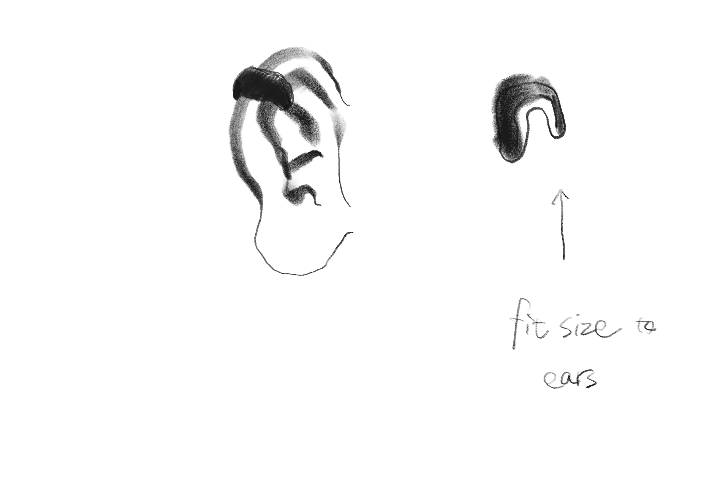
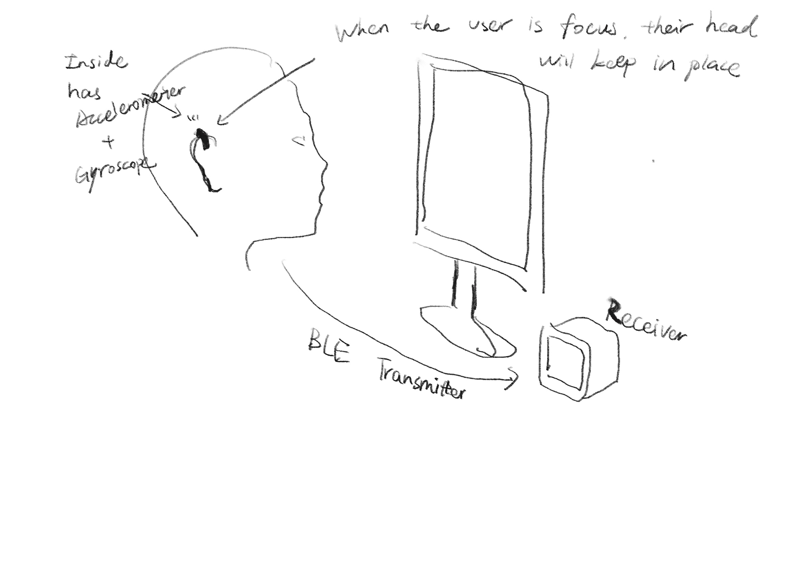

# FinalProject
# The "Deep Work Halo"

## 1. Overview
The Deep Work Halo is a privacy-focused workspace monitor designed to help users maintain and signal a "Flow State" without distraction. It consists of a discreet wearable that analyzes head stability to detect focus levels and wirelessly updates a desktop analog gauge. This gauge visually communicates the user's cognitive state to colleagues, acting as an automatic "Do Not Disturb" signal when deep work is achieved.

## 2. Visual Concept & Physical Design

### The Sensing Device (The "Smart Ear-Cuff")
* **Form Factor:** It uses a C-bridge design. One part sits behind the ear (battery/logic), and a smaller part sits inside/front of the ear (sensor), connected by a flexible silicone bridge.
* **Physical Features:** Completely screen-less and light-less to prevent user distraction. It houses the internal electronics and battery, featuring only a single pinhole reset button on the back.

### The Display Device ("The Flow Monolith")
* **Form Factor:** A minimalist, solid cube or rectangular prism (approx. 6cm x 6cm).
* **Materials:**
    * **Inner Core:** Matte black internal chassis.
    * **Outer Shell:** Thick, frosted clear acrylic (or smoked polycarbonate) acting as a massive light diffuser.
* **The Interface (Visual):**
    * **Screen:** A hidden LED Dot Matrix (8x8 or 16x16 grids) or a low-res OLED behind the acrylic face.
    * **Typography:** Uses a strict **Bitmap / Pixel font** for a retro-futuristic aesthetic.
    * **Function:** Displays the current time by default. When focus is detected, it transitions to a "Focus Score" (0-100) or a pixelated status icon.
* **The Interface (Atmosphere):**
    * **Breathing Light:** Buried RGB LEDs illuminate the entire acrylic block from within.
    * **Behavior:**
        * *Standby:* Off or faint white (Clock Mode).
        * *Flow State:* Gently pulses in warm Amber/Red (Do Not Disturb signal).

## 3. Technical Architecture

### Sensors & Inputs (The "Sense")
* **Device:** 6-Axis IMU (Inertial Measurement Unit).
* **Function:** Captures accelerometer and gyroscope data to track head micro-movements.
* **Logic:** A TinyML model running locally on the wearable classifies data into states (e.g., Focused vs. Fidgeting vs. Talking).

### Interface & Outputs (The "Feedback")
* **Stepper Motor:** Provides non-intrusive, peripheral visual feedback on focus depth.
* **RGB LED Ring:** Provides social signaling (Red/Amber = DND) to the external environment.

### Connectivity & Power
* **Wireless Protocol:** BLE (Bluetooth Low Energy) for efficient communication between the Wearable (Server) and Desktop Gauge (Client).
* **Power Source:**
    * *Wearable:* CR2032 Coin Cell (optimized for deep sleep).
    * *Desktop:* LiPo battery with USB-C charging.

